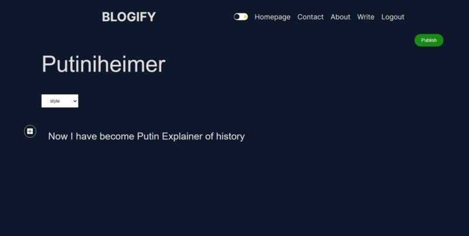
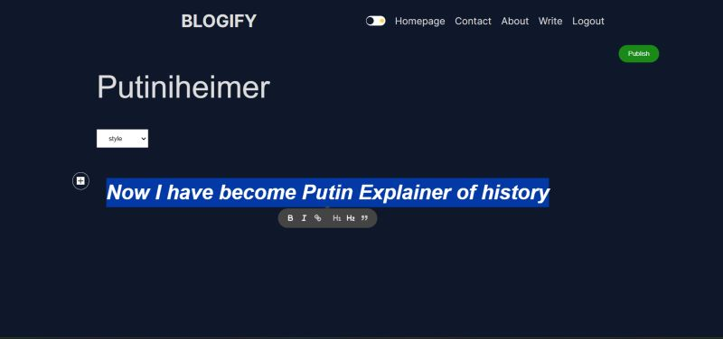
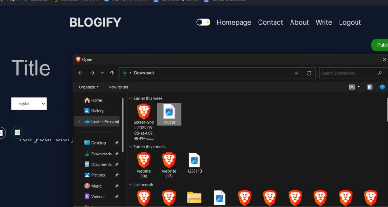
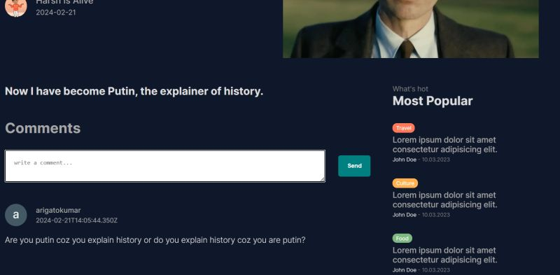

# Blogify

This project is a for creating and uploading blogs.

## How to Run

To run this project locally, follow these steps:

1. **Install Dependencies**: Run `npm i` to install the necessary packages.

2. **Start the Development Server**: After installing the dependencies, start the development server by running `npm run dev`.

3. **View the Project**: Once the development server is up and running, you can view the project in your web browser by navigating to `http://localhost:3000`.

## Screenshots

Here are some screenshots of the project:

1. 
2. 
3. 
4. 
5. 

